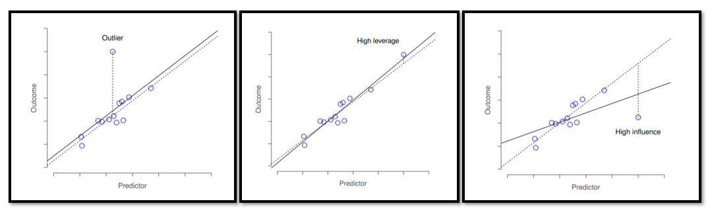

```{r setup, include=FALSE}
knitr::opts_chunk$set(echo = TRUE, warning=FALSE, message=FALSE)
```

## Questions I had before/during reading:

1. What is the difference between correlation and linear regression? when should you use one vs the other?
    - pearson correlation is equivalent to a linear regression with 1 predictor
    - linear regression can have multiple predictors 
2. Is mean centering the same as standardizing coefficients? when should you do either?
  - standardizing - subtracting the mean of the variable and dividing by sd. helps with the interpretation of the estimated coefficients
  - centering - just subtracting the mean. helps with the interpretation of the estimated constant 
3. what are people's opinions of $R^{2}$ vs adjusted $R^{2}$?    
  - $R^{2}$ is more interpretable whereas adjusted accounts for bias 
  - In her book, Dani says she prefers $R^{2}$
4. Are some assumptions more important than others? do people actually check the assumptions?
  - assumptions: linearity, homoscedasticity (variance of residuals is the same for any value of x), independence (observations are independent of each other), normality
  - SXL: Re: whether people do check assumptions, I'm sure some do but I don't remember seeing it reported very often!
  - ??
5. What does is mean to say "residuals that are independent of each other"?
  - SXL: I think this means that the residuals can be treated as independent samples (i.e., the probability of getting one value should not affect the probability of getting another)...?  
  - ??
6. What are the different types of residuals? 
  - regular vs standardised vs studentised
  - ??
7. What is an ideal workflow for checking your model and all the assumptions?
  - go through example below
8. What to do when specific assumptions are violated?
  - if data is non-linear, can try a transformation and check residual vs predicted/fitted values to see if that helped
    - what are some common transformations? $var^{2}$ or log()
  - if collinearity, drop one of the problematic variables or combine variables into a single predictor

- [datasets in R](https://machinelearningmastery.com/machine-learning-datasets-in-r/)
```{r}
library(tidyverse)
library(janitor)
library(car)
library(mlbench)
library(broom)

theme_set(theme_bw())
```

## simple linear regression
- Boston Housing dataset 
- first, let's look at relationships between different variables
```{r}
data(BostonHousing)
# ?BostonHousing

boston <- BostonHousing %>%
  as_tibble() 

pairs(boston, pch=19, lower.panel = NULL)
```

- pretty clear relationship between rm (avg number of rooms per dwelling) and medv (median value of owner-occupied homes)

- dis (distance to 5 employment centers) and nox (nitric oxides concentration) perhaps quadratic relationship??
  - this seems more interesting so let's look at this 
  - also good exercise because a lot of times our data won't be linear
  
- monotonically decreasing. exponential probably better than quadratric  
```{r}
ggplot(boston, aes(dis, nox)) +
  geom_point() +
  geom_smooth(method = "lm", se = FALSE) # not surprising, but not a very good fit 

m1 <- lm(nox ~ dis, data=boston)
m1
summary(m1)
tidy(m1)
glance(m1)

names(m1)

m1$coefficients # or coef(m1)


predict(m1, data.frame(dis=c(6)),
        interval="confidence") 

```

- predict function
- y = mx + c
- using our model:
  - y = -0.042*6 + 0.715 
  - y = 0.463
- predict()  returns 0.461

## check assumptions: what to look for in each?
*Most of these notes including the outliers images are taken from Danielle's book Chapter 15*

### 1. normality - assume residuals are normally distributed 
- can plot histogram to see distribution
- can do a Shapiro-Wilk test to check 
- can check the QQ plot 
```{r}
hist(x = residuals(m1),
     xlab = "Value of residual",
     main = "",
     breaks = 20)

shapiro.test(residuals(m1)) # here we see a significant result, so may be reason to be concerned 

plot(m1, which = 2)
```


### 2. linearity
- can plot fitted values against the observed values 
- can plot fitted values against the residuals `plot(model, which=1)` - want to see a straight, horizontal line  
  - `car::residualPlots()` creates a similar plot but for each predictor 
```{r}
fit_vals <- fitted.values(m1)

# want this to look linear
plot(x = fit_vals, y = boston$nox, xlab = "Fitted Values", ylab = "Observed Values") # ...not great

plot(m1, which=1)

residualPlots(m1) # Tukey test comes out significant, suggesting (clear) curvature 
```


### 3. homogeneity of variance - variance of the residuals is assumed to be constant 
- `plot(model, which=3)` - want to see straight, horizontal line through the middle of the plot
- `car::ncvTest()` non-constant variance test: looks at the relationship between the fitted values and the variance of the residuals
- note: if this assumption is violated, the se estimates associated with the regression coefficients are not entirely reliable
- robust se so don't have to assume variance is constant
```{r}
plot(m1, which=3)

ncvTest(m1) # and we see that we have violated yet another assumption
```


### 4. uncorrelated predictors 
- variance inflation factors (VIFs) can help us determine if predictors in the model are too highly correlated with each other 
  - high numbers are a sign that there is collinearity
*not sure I understand what's going on here..*
```{r}
# we'll create a second model that has 2 predictors 
m2 <- lm(nox ~ dis + zn, data=boston)
vif(m2)

m2_interaction <- lm(nox ~ dis * zn, data=boston)
vif(m2_interaction)

# try centering predictors (for interaction useful to center predictors)
m2_interaction <- lm(nox ~ scale(dis) * scale(zn), data=boston)
vif(m2_interaction)
```


### 5. residuals are independent of each other
- error is not systematic 
- can occur with time series data

### 6. no "bad" outliers
<br>

<br>


## multiple linear regression
```{r}
m2 <- lm(dis ~ ., data=boston) # all predictors
summary(m2)

summary(m2)$r.sq

vif(m2) # help determine if predictors are too highly correlated
# some numbers are large what to do next? try to remove collinearity?

m3 <- lm(dis ~ . - tax - lstat, data=boston) # not sure which variables to remove? systematic way to do this?
vif(m3) 
```

## non linear transformation
- when transforming predictors so it's ^2, you need to wrap it in `I()` because ^ has a special meaning in a formula 
- the fact that the transformed predictor (quadratic term) is significant, near 0, suggests it leads to an improved model
- can do anova() to quantify the extent to which the quadratic fit is superior to the linear fit
- can use the poly() to test multiple polynomial terms at once
```{r}
m4 = lm(dis ~ nox + nox^2, data=boston)
summary(m4)

m5 = lm(dis ~ nox + I(nox^2), data=boston)
summary(m5)

anova(m1, m5)

plot(m5)

# what about ^3? or ^4
m6 = lm(dis ~ poly(nox,5), data=boston)
summary(m6)

```


