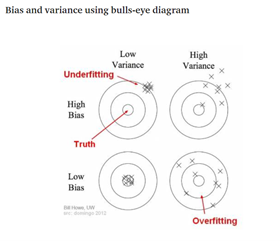
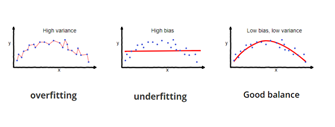

<!-- ctrl + shift + k to preview in viewer -->

*Most of these notes are from: An Introduction to Statistical Learning with Applications in R by Gareth James, Daniela Witten, Trevor Hastie, Robert Tibshirani plus some additional notes from Learning Statistics with R by Danielle Navarro* 

# Chapter 1: Introduction
- **supervised statistical learning** = building a statistical model for predicting or estimating an output based on one or more inputs
- **unsupervised statistical learning** = there are inputs, but NO outputs. we lack a response variable that can supervise our analysis
- *semi-supervised learning* = some of the observations have both predictor measurements and a response measurement, but the rest of the observations only have a predictor measurement 
- continuous or quantitative output (numerical values) = **regression problem**
- categorical output = **classification problem** 
- generalized linear models (GLMs) = entire class of statistical learning methods including linear and logistic regression as special cases
- generalized additive models = class of non-linear extensions to GLMs

# Chapter 2: Statistical Learning
- statistical learning = set of approaches for estimating *f*
- 2 main reasons to estimate *f*: prediction and inference
- accuracy of the estimate of *f* depends on reducible and irreducible error
  - **reducible error** = ability to improve the accuracy of *f* by finding the most appropriate statistical model
  - **irreducible error** = there is always some error that will remain ($\epsilon$), no matter how well you estimate *f* 
- the aim here is to learn about techniques to estimate *f* by minimizing the reducible error 

## parametric methods
- reducing the problem of estimating *f* down to one of estimating a set of parameters 
- disadvantage: the model we choose will usually not match the true unknown of *f*
- to try to address this problem, we can choose a more flexible model, but that requires estimating a greater number of parameters and can lead to overfitting (fits errors/noise too closely)

## non-parametric methods
- do not make explicit assumptions about the functional form of *f*, but rather estimate *f* get as close to the data points as possible without being too rough or wiggly
- disadvantage: requires a very large number of observations
- example: thin-plate spline where you have to specify the level of smoothness
- tradeoff between flexibility and interpretability 
  - in general, as the flexibility of a method increases, its interpretability decreases 
  
## regression vs. classification
- **regression** = problems with quantitative responses (example: least squares linear regression)
- **classification** = problems with qualitative responses (example: logistic regression)

## assessing model accuracy
- **mean squared error (MSE)** = most commonly used measure for regression models to evaluate the performance of the statistical model
- training MSE = computed using training data that that was used to fit the model 
- but we are really interested in the accuracy of the predictions in test data (previously unseen)
- we want to choose the method that produces the lowest test MSE 
- as flexibility of the statistical learning method increases, we see a monotone decrease in the training MSE and a U-shape in the test MSE 

## bias-variance tradeoff
  
  - Bias = the inability for a machine learning method (like linear regression) to capture the true relationship is called bias
  - so, a straight line will have a larger bias than a squiggly line that fits each point and the squiggly line will be able to perfectly fit the training set (overfit). However, the straight line will most likely do a much better job fitting the testing set 
  - Variance = the difference in fits between data sets in called variance
  - so, the straight line has higher bias, but will consistently produce relatively good fits to testing set so lower variance
  
- **in order to minimize expected test error, we need a statistical learning method that achieves BOTH low variance and low bias**
- **variance** = the amount by which estimated *f* would change if we estimated using a different training data set
- **bias** = error that is introduced by approximating a real-life problem 
- general rule, as flexibility increases, the variance will increase and the bias will decrease 
- for classification, a good classifier is one where the test error is smallest (examples: Bayes Classifier, K-Nearest Neighbors)
- [Understanding the Bias-Variance Tradeoff](https://towardsdatascience.com/understanding-the-bias-variance-tradeoff-165e6942b229)  
 

  
  
#  Chapter 3: Linear Regression  
- useful tool for predicting a quantitative response
- linear regressions are "fancier" versions of Pearson correlation...but more powerful
- y = mx + c
- y = b1Xi + b0 + e 
- estimated regression coefficients minimize the sum of the squared residuals, also known as "line of best fit"
- Pearson correlation is equivalent to a linear regression with one predictor

## simple linear regression - a single predictor variable 
- while the true relationship is usually not known, least squares line can always be computed using the coefficient estimates 
- **RSE** = considered a measure of the lack of fit of the model to the data
- **R^2^** = an alternative measure of fit that is the proportion of variance explained and has an interpretional advantage over the RSE

## multiple linear regression - more than 1 predictor
- R^2^ will always increase when more variables are added to the model, but if adding a variable to the model only increases R^2^ by a tiny amount, you have more evidence that the variable can be dropped 
- confidence interval to quantify uncertainty surrounding the average over a large number of cities for example
- prediction interval to quantify uncertainty surrounding a particular city 

## Other considerations in regression models
- if a qualitative predictor (factor) has levels, you can create a dummy variable(s) where one category is arbitrarily chosen as the baseline factor and the other variables are compared to it. Can check the p values to see if there's a significant difference between the groups
- the relationship between the predictors and response are additive and linear
  - additive: the effect of changes in a predictor X on the response Y is independent of the values of the other predictors
  - linear: the change in the response Y due to a 1 unit change in X is constant 
- interaction effect also known as synergy effect in marketing: can easily add an interaction term by computing the product of X~1~ and X~2~
- **hierarchical principle** = if you include an interaction in a model, you should also include the main effects regardless of the p values
- models that have different intercepts but same slopes = parallel lines
- models that have different intercepts and different slopes = can have an interaction
- **polynomial regression** = accommodate non-linear relationships
- one way to include non-linear associations to a linear model is to include transformed versions of the predictors
  - example: 'horsepower' and 'horsepower^2^'
  - but this is still a linear model!

## potential problems when fitting a linear regression model
  
  - `car` package in R is useful for regression diagnostics 

  1. **non-linearity of the response-predictor** relationships
  - **residual plots** = useful graphical tool for identifying non-linearity
  - plot the residual vs predicted/fitted values and ideally there will be no discernible pattern. If there's a clear U-shape or other noticeable shape, that indicates non-linearity in the data 
  - if there's a clear pattern, use a transformation and then try to plot the residuals vs fitted values and hopefully there will little to no pattern
  
  2. **correlation of error terms**
  - important assumption: error terms are uncorrelated
  - if correlated, estimated se will tend to underestimate the true se giving us an unwarranted sense of confidence in our model
  - frequently occur in time series data
  
  3. **non-constant variance of error terms**
  - another assumption: error terms have a constant variance or residuals are normally distributed
  - can identify this heteroscedasticity if you see a funnel shape in the residual plot (residual x fitted)
  - one possible solution: transform response Y for example, logY or sqrt(Y)
  - if this assumption is violated, the standard error estimates are also no longer all that reliable so t tests for the coefficients aren't exactly right
  
  4. **outliers**
  - observations for which the response y is unusual given x
  - to test for outliers, you can plot the studentized residuals x fitted values and would expect to see values between -3 and 3 
  
  5. **high leverage points**
  - unusual value of x 
  - removing high leverage points can have a much greater impact on the least squares line 
  - to quantify an observation's leverage, you can compute the *leverage statistic* 
  
  6. **influence**
  - a high influence observation is an outlier + high leverage
  - use Cook's distance to operationalise (> 1 often considered large)
  
  7. **collinearity** 
  - refers to the situation in which two or more predictor variables are closely related to one another
  - contouor plots can help visualize collinearity 
  - also, a correlation matrix can help detect collinearity - an element of the matrix that is large in absolute value indicates a pair of highly correlated variables
  - VIFs (varaince inflation factors) can also help determine if predictors are too highly correlated: `vif()` in car package
  - **multicollinearity** = collinearity to exist between 3 or more variables even if no pair of variables has a particularly high correlation 
  - variance inflation factor = good way to assess multicollinearity (VIF that exceeds 5 or 10 is problematic)
  - two solutions for dealing with collinearity:
    - drop one of the problematic variables from the regression
    - combine the collinear variables together into a single predictor (example: `limit` and `rating` are collinear, create a new variable `credit worthiness` that accounts for both)
    
## Comparison of linear regression with K-nearest neighbors

- linear regression is an example of a parametric approach because it assumes a linear functional form for f(X)
- non-parametric methods do not assume a parametric form of f(X) and therefore provide a more flexible approach for performing regression 
- one of the most common methods: K-nearest neighbors regression (KNN regression)
- optimal value for K will depend on the bias-variance trade-off 
- the parametric approach will outperform the non-parametric approach if the parametric form that has been selected is close to the true form of f
- parametric approach will also be better when there is a small number of observations per predictor
  

#  Chapter 4: Classification

- logistic regression: approaches for predicting qualitative responses, allows us to solve classification problems
  - models the probability that Y belongs to a particular category
- 3 of the mose commonly used classifiers: logistic regression, linear discriminant analysis (LDA), K-nearest neighbors 
- often deal with binary classification (0 or 1)
- linear regression model on binary data will not produce a good fit
- instead, transform linear regression to a logistic regression curve that can only go between 0 and 1
- Sigmoid aka Logistic function - take any value and output will be only between 0 and 1
  - Sigmoid function: $$S(x) = \frac{1}{1 + e^{-x}}$$
  - logistic function: $$p(X) = \frac{e^{\beta_0 + \beta_1X}}{1 + e^{\beta_0 + \beta_1X}}$$
- used least squares approach to estimate the unknown linear regression coefficients
- for binary responses with 0/1 coding, regression by least squares can work but using linear regression, may get estimates outside of [0,1] interval (see LDA)
- more common to use maximum likelihood for logistic regressions (least squares is a special case of maximum likelihood)
- results using one predictor can often be very different and even lead to opposing interpretations when using multiple predictors 
  - example: "a student is riskier than a non-student if no information about the student's credit card balance is available. However, that student is less risky than a non-student *with the same credit card balance*"

## LDA 

Why use LDA?

- parameter estimates for the logistic regression model are surprisingly unstable
- common to use when there are more than two response classes

LDA for p = 1

- assume data is a normal or Gaussian distribution
- LDA assumes a common variance $\sigma^2$
- Figure 4.4 left shows the normal density functions for each of the 2 classes
- the Bayes classifier is drawn as the dotted line where the two distributions intersect
  - $\frac{\mu_{1} + \mu_{2}}{2}$ 
- in real life situations, we are not able to calculate the Bayes classifier, so we use the LDA method which approximates the Bayes classifier by plugging in the following parameters:
  - $\pi_{k}$ = prior probability that an observation belongs to *k*th class
  - $\mu_{k}$ = average of all the training observations from the *k*th class
  - $\hat\sigma^2$ = weighted average of the sample variances for each of the *K* classes

- See a walk-through example in `classification.Rmd` 
- [And here's a helpful YouTube tutorial on LDA and QDA](https://www.youtube.com/watch?v=IMfLXEOksGc)
  - similar to LDA, but assumes each class has its own covariance matrix
  - LDA tends to be better if there are relatively few training observations and so reducing variance is crucial
  - QDA tends to be better if the training set is very large or if the assumption of a common covariance matrix for the classes is clearly not possible
  
## A Comparison of Classification Methods

Classification methods: logistic regression, LDA, QDA, K-nearest neighbors 

- logistic regression (coefficients estimated with maximum likelihood) and LDA (coefficients estimated using mean and variance from a normal distribution) both produce linear decision boundaries
  - so, only differ in fitting procedures
- KNN is completely non-parametric so no assumptions are made about the shape of the decision boundary
- QDA is kind of like a compromise - quadratic decision boundary but not as flexible as KNN

- When decision boundaries are linear, LDA and logistic regresion approaches will tend to perform better 
- When decision boundaires are non-linear, QDA may give better results 
- When decision boundaries are even more complicated, KNN may be best, but KNN does not tell us which predictors are important 

#  Chapter 5: Resampling Methods

- repeatedly drawing samples from a training set and refitting a model of interest on each sample in order to obtain additional information about the fitted model
- **model assessment** = the process of evaluating a model's performance 
- **model selection** = the process of selecting the proper level of flexibility 
- reminder: training error can often be quite different than test error

1. Cross-validation (CV)
 
- validation = randomly dividing the available set of observations into 2: training set and validation/hold-out set
  - conceptually simple and easy to implement
  - drawbacks: validation estimate of the test error can be highly variable and because only a subset of observations are used to fit the model, validation set error rate may overestimate the test error rate
- leave-one-out CV
  - far less bias than validation set approach and tends not to overestimate the test error rate as much
- k-fold CV
  - typically k = 5 or k = 10
- classification when Y is qualitative = use the number of misclassified observations rather than MSE to quantify test error 

2. Bootstrap
- widely applicable and powerful statistical tool that can be used to quantify the uncertainty associated with a given estimator or statistical learning method
  
#  Chapter 6: Linear Model Selection and Regularization 
- there are alternatives to the least squares fitting method that can improve the simple linear model with better prediction accuracy and model interpretability 
  - prediction accuracy: if the number of observations is not much larger than the number of variables, least squares can result in a lot of variability and overfit and poor predictions on future test data. Constraining/shrinking the estimated coefficients can reduce variance with negligible increases in bias
  - model interpretability: there are often "irrelevant" variables that are not associated with the response, so can remove these variables (set corresponding coefficients to 0)

1. Subset Selection
- Best subset selection 
  - fit a separate least squares regression for each possible combination of predictors...with too many predictors this is not possible
  - pick the "best" model - model that has the smallest RSS or largest R^2
  - but, small RSS/large R^2 indicates low *training* error, but we want a model with low *test* error
  - select best model using CV predictiton error, Cp, BIC, or adjusted R^2
- Stepwise selection
  - explores a far more restricted set of models
  - forward/backward stepwise selection 

## choosing the optimal model
  - training set RSS and R^2 cannot be used to select from models with different number of variables
- to select the best model with respect to test error, need to estimate the test error 
  - indirectly: make adjustments to teh training error to account for the bias due to overfitting (AIC, BIC, Cp, adjusted //R^2)
  - directly: use either validation or CV validation approaches. advantage that it is a direct test and makes less assumptions of the true underlying model. can use 1 standard error rule - if models are equally good, best to choose the simpler one
  
2. Shrinkage
- uses all the predictors and constrains/regularizes the coefficient estimates that shrinks the estimates towards 0

## Ridge Regression
  
- find a better line/model that may not fit the training set as well by introducing a small amount of bias into how the model fits the training data, but in return for a small amount of bias you get a significant drop in variance (one example of where this may be useful is if your model is overfitting the training data)
- so, by starting with a slightly worse fit, ridge regression will ultimately provide a better long term predictions 
- very similar to least squares but coefficients are estimated slightly differently
  - least squares: minimizes the sum of the squared residuals
  - ridge regression: minimizes the sum of the squared residuals + $\lambda x slope^2 (all squared parameters, excpet y intercept)
- can try a bunch of values for $\lambda using cross validation to determine which one results in the lowest variance  
- ridge regression works for both continuous and discrete variables
- even when there isn't enough data to find the least squares estimates, ridge regression can find a solution using cross validation and the penalty

- will always include all the predictors, as the "shrinkage penalty" will shrink the coefficients towards 0, but not actually to 0
- do not shrink intercept
- advantage over least squares because of the bias-variance tradeoff
- tuning parameter - isn't estimated, just sort of guessed, but can use 10-fold cross validation to help find the best value for that tuning parameter

## The Lasso
- having all the predictors with ridge regression poses a challenge for model interpretation
- with the lasso, the penalty actually forces some coefficients to shrink to zero when the tuning parameter $\lambda is very large
- this makes the models generated from lasso easier to interpret because it uses only a subset of predictors
- may expect the lasso to perform better when some predictors can shrink to 0, but ridge regression to perform better when all coefficents are roughly equal size 

3. Dimension Reduction 

